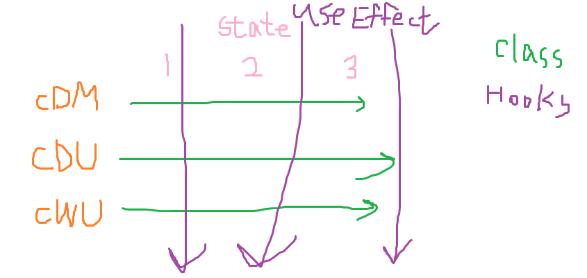

#### 가위바위보게임을 만들면서..
: setInterval, clearInterval과 React가 잘 어우러지게 하는 방법에 대해서 배운다.
> class보다는 hooks 만들 때 좀 복잡해지니 주의깊게 보세유

# lifecycle (컴포넌트의 일생...)
: RSP라는 컴포넌트가 client에서 불려와서 렌더링 되는데, 렌더링 되면 컴포넌트가 DOM에 딱 붙는 순간이 있다.\
: render 함수가 실행되면 react가 이 jsx를 DOM에다가 딱 붙여주는데\
: 그 순간에 특정한 동작을 해 줄 수 있음.
### Class일 때, lifecylce 순서 (잘 기억해 두기🔥🔥)
: constructor 부분, 메서드가 class에 갖다 붙음 -> render 첫 실행 -> (ref 실행) -> componentDidMount ->\
setStae/props 바뀔 때 -> shouldComponentUpdate -> render 실행 -> componentDidUpdate ->\
(부모 컴포넌트에 의해서 자식 컴포넌트인 내가 없어질 때 -> componentWillUnmount -> 소멸(화면에서 사라짐))

## 1. componentDidMount
: render가 성공적으로 처음 실행 되었다면 componentDidMount가 실행된다.\
: setState나 props 때문에 rendering이 다시 일어났다면(리렌더링) componentDidMount가 실행 X.\
: setState를 사용하고 싶은데, 어디서 써야할지 모를 경우에 사용.\
: 비동기 요청을 많이 함.

## 2. componentWillUnmount
: 컴포넌트가 제거 되는 경우가 있는데, 그 직전에 componentWillUnmount가 실행된다.\
> 부모 컴포넌트에 의해서 자식 컴포넌트인 내가 없어질 때
: componentDidMount에서 했던 작업들을 제거하는 용도.
> 보통은 componentDidMount와 componentWillUnmount가 짝이다.ㅋ.ㅋ.ㅋ.

: 비동기 요청의 정리를 많이 함.

## 3. componentDidUpdate
: re-rendering이 일어났다면 componentDidUpdate가 실행된다.

## 꿀팁
- setInterval\
: 일정시간동안 계속 반복작업해준다.
``` jsx
setInterval(() => {
    console.log('👸👸');}, 1000);
```
: 취소를 안해주면 계속 돌아간다.\
: 컴포넌트가 삭제된다고 해도 계속계속 돌아감!\
: 메모리 누수가 일어난다
> coreJS에서 자세하게 봤으니까 나중에 정리해둔거 보면서 복습하기.
``` jsx
clearInterval(this.interval);
```
: 그래서 componentDidMount에 setInterval 해주고 componentWillUnmount에서 clearInterval 해준다. 짝꿍💑

## 클로저 문제
: 비동기안에서 바깥에 있는 함수를 참조하면 문제가 생긴다.
``` jsx
componentDidMount() { 
    // const {imgCoord} = this.state; // 이 친구가 여기있으면 error!
    this.interval = setInterval(() => {
        const {imgCoord} = this.state; // 정상
        if(imgCoord === rspCoords.바위) {
            this.setState({
                imgCoord: rspCoords.가위,
            });
        } else if (imgCoord === rspCoords.가위) {
            this.setState({
                imgCoord: rspCoords.보,
            });
        } else if (imgCoord === rspCoords.보) {
            this.setState({
                imgCoord: rspCoords.바위,
            });

        }
    }, )
}
```
## 꿀팁2
- setTimeout\
: 일정시간동안 멈췄다가 다시 시작해준다.
``` jsx
setTimeout(() => {
    this.interval = setInterval(this.changeHand, 100); // 1초 후에 다시 시작된다.
}, 1000);
```
## 꿀팁3 (리액트에서 많이 쓰는 패턴)
__고차함수__\
: 메서드안에 함수를 호출하는 부분을 바꿀 수 있다.
- 바꾸기 전
``` jsx
onClickBtn = (choice) => {
    // ...
}
<button id="rock" className="btn" onClick={() => this.onClickBtn('바위')}>✊</button>
```
- 바꾸고 나서
``` jsx
onClickBtn = (choice) => () => {
    // ...
}
<button id="rock" className="btn" onClick={this.onClickBtn('바위')}>✊</button>
```
> 매개변수 있어도 가능 (e) => 이렇게 !!

### 질문
- setInterval에 시간을 짧게 하면 render와 엇갈리는 경우가 있나?\
: 큐처럼 차기 때문에 ㄴㄴ해.
- setState 여러개 연달아서하면 각각 렌더링 되는건가?\
: 한번에 모아서 렌더링한다.
> 그대신 setInterval 거쳐서 나오는 setState는 각각 렌더링 될 것.


### Hooks...
: Hooks는 lifecycle을 가지고 있지 않음.\
-> 흉내내기는 가능.\
=> useEffect 사용
## useEffect
: useRef 처럼 함수 컴포넌트안에다가 적어줘야함.
> componentDidMount, componentDidUpdate 같은 것들을 1:1 대응하면서 똑같은 느낌 X.
>> 이러한 역할을 한다는 이야기.
``` jsx
useEffect(()=> { // componentDidMount,componentDidUpdate 역할
        interval.current = setInterval(changeHand, 100);
        return () => { // componentWillUnmount 역할
            clearInterval(interval.current);
        };
},[]);
```
> 배열이 비었을 경우 : 처음에만 실행하고, 뭐가 바뀌든 다시 실행 X.
>> componentDidMount 역할이 되는거네..
>>> 배열에 값 넣으면 componentDidUpdate 역할
: useEffect의 첫번째 인수 - 함수, 두번째 인수 - 배열\
: 이 배열이 클로저 문제 같은 것들을 해결하게해준다.\
: 바뀌는 state, useEffect를 실행하고 싶은 state를 배열에 넣어준다.
> 두번째 인수인 배열에 넣은 값들이 바뀔 때 useEffect 실행.
``` jsx
useEffect(()=> { // componentDidMount,componentDidUpdate 역할
        interval.current = setInterval(changeHand, 100);
        return () => { // componentWillUnmount 역할
            clearInterval(interval.current);
        };
},[imgCoord]);
```
함수 컴포넌트는 렌더링이 될 때마다 안에 값들이 통째로 다시 실행된다.
그래서 렌더링 다시 될 때 마다 useEffect 부분이 계속 실행되는 것이다.
ex) 위의 경우에는 매번 ```interval.current = setInterval(changeHand, 100);``` 실행 후 return값인 ```clearInterval(interval.current);```이 실행된다.
=> 매번 clearInterval을 하기 때문에 그냥 setTimeout을 하는 것과 동일함.

정리)) useEffect는 두번째 인수인 배열에 넣은 값이 바뀔 때마다 useEffect가 실행된다.\
=> setInterval이 실행되었다가 clearInterval되었다가를 반복함.
> 함수 컴포넌트는 렌더링이 될 때마다 안에 값들이 통째로 다시 실행된다는 특성 때문에 그러하다.
>> 외우는게 더 나을 수도 있음,,,
>>> Hooks에서 어려운 부분이 이부분,,,

## useEffect 꿀팁
: useEffect는 여러번 사용 가능
> state 별로 다른 효과를 내고 싶을 수가 있으니까.
>> Class의 경우 componentDidMount나 componentDidUpdate에서 모든 state를 조건문으로 분기 처리함.

## 꿀팁
- useLayoutEffect\
: 레이아웃의 변화를 감지할 때 사용
ex) 사이즈 변화를 줄 때(주기 직전에) 실행
> useEffect는 사이즈 변화 주고나서 실행

## 더 쉽게 설명하자면...
state가 result, imgCoord, score가 있다고 하자.\
- Class에서는\
: componentDidMount, componentDidUpdate, componentWillUnmount 모두 result, imgCoord, score 접근(?)이 가능하다.
``` jsx
componentDidMount() {
    this.setState({
        imgCoord: 3,
        score: 1,
        result: 2,
    })
}
```
- Hooks에서는\
: result에 useEffect 한개, imgCoord에 useEffect 한개, score에 useEffect 한개 접근이 가능
> 물론 한 useEffect에서 여러개를 담당할 수 있다!
>> 그니까 동작이 다르면 따로따로 해줘야한다는 말인거같당.
``` jsx
useEffect(() => {
    setImgCoord();
    setScore();
    }, [imgCoord, score]);

useEffect(() => {
    setResult();
    }, [result]);
```


## 질문
Q. setInterval은 꼭 여기 안에서만 사용해야하나요?\
A. 아뇨. 필요할 때 맞춰서 다른 함수에 넣어도 괜찮. 하지만 setInterval을 사용했다면 componentWillUnmount에서 정리해주기 (clear)


