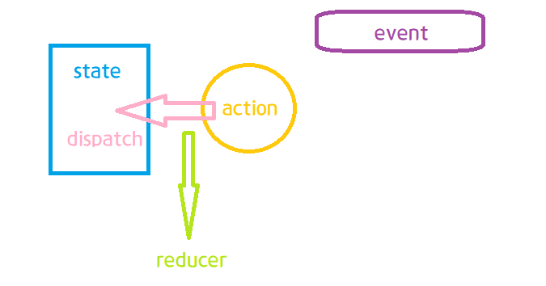

## useReducer
: redux의 핵심부분이 이건데 이 부분을 그대로 들여왔음\
: react에서 redux와 비슷한 효과를 낼 수 있음.
> 그렇다고 redux를 대체할 순 없음.
>> 비동기적인 작업을 할 때는 redux 써야한다.
- 언제 사용?\
: state가 많아지면 관리가 힘들고, setState를 자식에게 넘겨줄 때 너무 많아서 복잡.\
: 사용하면 하나의 setState로 통일이 가능하기 때문에 사용한다.

``` jsx
const initialState = {
    winner: '',
    turn: 'O',
    tableData: [['','',''],['','',''],['','','']],
    /* 이거 대신 써준거... 
    const [winnner, setWinner] = useState('');
    const [turn, setTurn] = useState('0');
    const [tableData, setTableDate] = useState([['','',''],['','',''],['','','']]);
    */
};

const reducer = (state, action) => {
    // state를 어떻게 바꿀지 적어준다.
};
// 배열의 reduce 함수처럼 뭔가를 줄인다는 뜻.
const TicTacToe = () => {
    const [state, dispatch] = useReducer(reducer, initialState);
    // 세번째 인자에 지연초기화까지 넣어주는데 복잡해질때만 사용.
    return (
        <>
        <Table />
        {winner && <div>{winner} 승🐱‍🏍</div>}
        </>
    )
};
```

### dispatch
- dispatch 안에 들어가는 것 : action 객체\
: dispatch하면 action을 실행한다고 생각하면 된다.
> redux에서 따온 개념
``` jsx
const onClickTable = useCallback(() => {
        dispatch({ type: 'SET_WINNER', winner: 'O'});
    }, []);
```
- action은 어떤 역할을 하나?\
: action만 있다고 해서 자동으로 state가 바뀌는 건 아니고 이 action을 해석해서 state를 직접 바꿔주는 역할이 필요한데...\
: 이게 바로 reducer

- action을 dispatch 할 때 마다 reducer가 실행된다.
``` jsx
const reducer = (state, action) => {
    // state를 어떻게 바꿀지 적어준다.
    switch(action.type) {
        case 'SET_WINNER':
            // state.winner = action.winner; 라고 직접 바꾸면 안된다.
            return {
                ...state, // spread로 얕은 복사
                winner: action.winner,
            };
    }
};
```

## 정리하자면...
1. 처음 state가 있다.(ex)initialState)
2. state를 바꾸고 싶으면 event가 실행될 때
3. action을 만들어서
4. action을 통해 dispatch를 해주어야한다.
> 직접 state를 바꿀 수 없다.
5. 이때, action을 어떻게 처리할지는 reducer가 관리,기록.


## 꿀팁
- action의 이름은 보통 대문자로 한다.