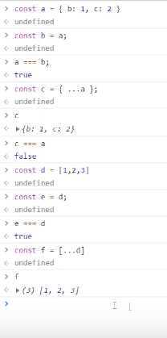

## useReducer
: redux의 핵심부분이 이건데 이 부분을 그대로 들여왔음\
: react에서 redux와 비슷한 효과를 낼 수 있음.
> 그렇다고 redux를 대체할 순 없음.
>> 비동기적인 작업을 할 때는 redux 써야한다.
- 언제 사용?\
: state가 많아지면 관리가 힘들고, setState를 자식에게 넘겨줄 때 너무 많아서 복잡.\
: 사용하면 하나의 setState로 통일이 가능하기 때문에 사용한다.

``` jsx
const initialState = {
    winner: '',
    turn: 'O',
    tableData: [['','',''],['','',''],['','','']],
    /* 이거 대신 써준거... 
    const [winnner, setWinner] = useState('');
    const [turn, setTurn] = useState('0');
    const [tableData, setTableDate] = useState([['','',''],['','',''],['','','']]);
    */
};

const reducer = (state, action) => {
    // state를 어떻게 바꿀지 적어준다.
};
// 배열의 reduce 함수처럼 뭔가를 줄인다는 뜻.
const TicTacToe = () => {
    const [state, dispatch] = useReducer(reducer, initialState);
    // 세번째 인자에 지연초기화까지 넣어주는데 복잡해질때만 사용.
    return (
        <>
        <Table />
        {winner && <div>{winner} 승🐱‍🏍</div>}
        </>
    )
};
```

### dispatch
- dispatch 안에 들어가는 것 : action 객체\
: dispatch하면 action을 실행한다고 생각하면 된다.
> redux에서 따온 개념
``` jsx
const onClickTable = useCallback(() => {
        dispatch({ type: 'SET_WINNER', winner: 'O'});
    }, []);
```
- action은 어떤 역할을 하나?\
: action만 있다고 해서 자동으로 state가 바뀌는 건 아니고 이 action을 해석해서 state를 직접 바꿔주는 역할이 필요한데...\
: 이게 바로 reducer

- action을 dispatch 할 때 마다 reducer가 실행된다.
``` jsx
const reducer = (state, action) => {
    // state를 어떻게 바꿀지 적어준다.
    switch(action.type) {
        case 'SET_WINNER':
            // state.winner = action.winner; 라고 직접 바꾸면 안된다.
            return {
                ...state, // spread로 얕은 복사
                winner: action.winner,
            };
    }
};
```

## 정리하자면...
1. 처음 state가 있다.(ex)initialState)
2. state를 바꾸고 싶으면 event가 실행될 때
3. action을 만들어서
4. action을 통해 dispatch를 해주어야한다.
> 직접 state를 바꿀 수 없다.
5. 이때, action을 어떻게 처리할지는 reducer가 관리,기록.


## 꿀팁
- action의 이름은 보통 대문자로 한다.
- action은 마음대로 만들면 된다, 그대신 reducer에서 잘 처리해주면 된다.
- react의 좋은점\
: state만 바꿔주면 화면을 알아서 바꿔준다.
- 객체가 있으면 얕은 복사를 해준다고 생각(배열도 가능)


``` jsx
case CLICK_CELL: {
            // 불변성을 지켜야하기 때문에 우리가 바꾸고 싶은 부분만 바꿔야한다.
            // 그래서 복잡해진다.
            const tableData = [...state.tableData]; // 얕은 복사
            tableData[action.row] = [...tableData[action.row]];
            // td에서 넣어줬던 rowIndex
            return {
                ...state,
            }
        }
```
> useReducer에서 불변성 지키는데에 있어서 단점이다
>> immer라는 라이브러리로 가독성 해결한다.

- react에서 state 바꿀 때 불변성을 꼭 지켜줘야 하기 때문에 중요합니다!✨

- context api\
: 사용하면 상속 관계 귀찮음 복잡성 해결 가능!
> 한번에 다이렉트로 가져다 드립니다 ^.^

- dispatch에서 state를 변경하는 것이 비동기이다.
> useEffect를 사용해줘야한다.
>> redux는 동기적으로 바뀜.

## 정리
기본적으로 useState를 해서 State를 여러개를 만들었는데, 이게 많아지면 복잡해지기 때문에 state를 한방에 모아서 처리하고, setState하는 것도 dispatch를 해주기 위해 reducer를 사용\
=> state를 하나로 다 모아두고 얘를 action을 통해서만 바꾼다.
> action은 type은 이름이다.
- dispatch가 되면(action이 실행되면) reducer에 정의해둔대로 state를 바꾼다.
> state를 바꿀때는 불변성이 중요하다.
- useState가 많아지면 useReducer를 고려해보는 것이 좋다.

## 성능 최적화
: 작은 컴포넌트부터 살펴보자.
### useEffect, useRef를 이용해서 리렌더링 되는 이유 찾기
1. ref는 계속바뀌지만 props가 안바뀌는 경우가 있는데 그걸 찾아보자.
``` jsx
const Td = ({rowIndex, cellIndex, dispatch, cellData}) => {

    const ref = useRef([]);
    useEffect(() => {
        console.log(rowIndex === ref.current[0], cellIndex === ref.current[1], dispatch === ref.current[2], cellData === ref.current[3]);
        ref.current = [rowIndex, cellIndex, dispatch, cellData];

    }, [rowIndex, cellIndex, dispatch, cellData])
// ...
};
```
> 같지 않으면 false가 되고 그래서 그 친구 때문에 리렌더링이 되는 것
>> 하지만, 이 문제에서의 td의 리렌더링은 props 때문이 아니였다...
### Props 문제가 아니라면 ... react.memo 사용
: memo로 컴포넌트를 감싸주자!
### memo로도 안된다면 ... useMemo 사용 (최후의 수단)
: 값을 기억하는게 useMemo인데, 컴포넌트를 기억할 수도 있음.
``` jsx
return (
        <tr>
            {Array(rowData.length).fill().map((td, i) => (
                useMemo(
                    <Td key={i} dispatch={dispatch} rowIndex={rowIndex} cellIndex={i} cellData={rowData[i]}>{''}</Td>,
                    [rowData[i]],
                )
            ))}
        </tr>
    );
```    